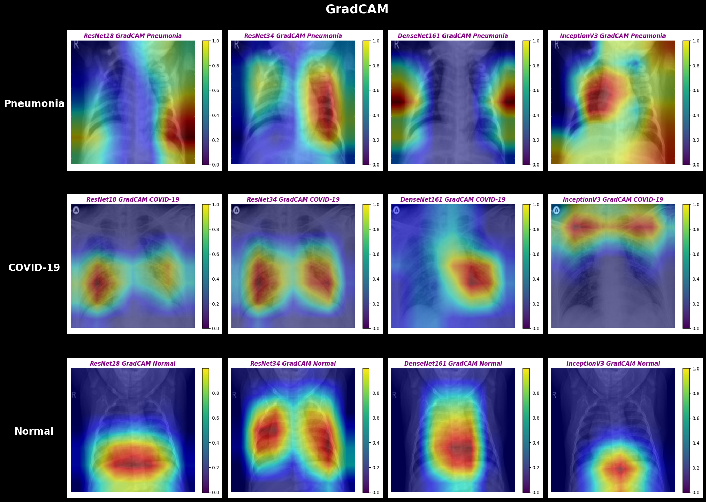
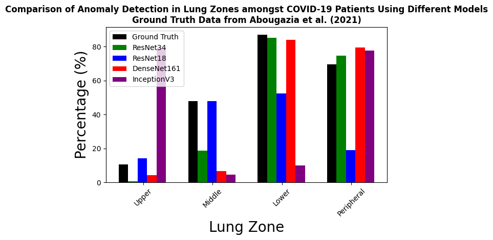
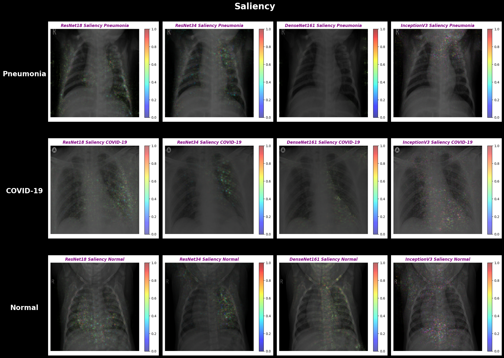
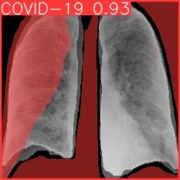
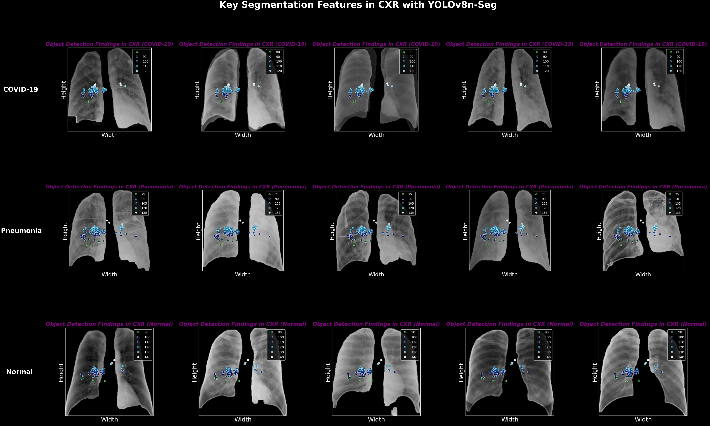

# Concordance with Clinicians: Assessing ML Models for COVID-19 Diagnosis


> **Best accuracy ≠ best clinical alignment.** This study benchmarks four CNN architectures and a YOLOv8n-seg segmentation model on **5,266+ chest X-ray images** for COVID-19, Pneumonia, and Healthy classification, then uses **Grad-CAM and Saliency interpretability** to identify which model's *reasoning* most resembles a doctor's, not just which has the best metrics.
>
> **The headline finding**: on the full chest X-ray dataset, **DenseNet161 wins on raw performance (90.18% accuracy)** but **ResNet34 wins on clinical alignment** as its attention regions deviate from physician ground-truth lung zones by just **11.57%**, versus up to **49.32%** for the worst aligned model. The choice between them depends on whether the deployment context prioritizes accuracy or interpretability.

📄 **[Read the full 50-page research paper →](https://drive.google.com/file/d/1YKOquZfB0PWgLXoil0_miafx5ck5v2lf/view?usp=sharing)**


*GradCAM activation maps for ResNet18, ResNet34, DenseNet161, and InceptionV3 on Pneumonia, COVID-19, and Healthy chest X-ray samples. Notice how ResNet34 (column 2) consistently localises within anatomically relevant lung regions whereas DenseNet161 (column 3) attends to less coherent areas. The map serves as a visual preview of the headline finding that the most clinically aligned model is not the same as the most accurate one.*    

---

## TL;DR Results

### Dataset 1 — Full Chest X-rays (2,140 images)

| Model | Accuracy | Macro F1 | Mean Lung-Zone Deviation |
|---|---:|---:|---:|
| ResNet18 | 85.16% | 84.49% | 22.20% |
| ResNet34 | 88.31% | 88.39% | **11.57%** 🥇 |
| **DenseNet161** | **90.18%** | **90.24%** | 15.19% |
| InceptionV3 | 86.44% | 86.82% | 49.32% |

*Best accuracy: DenseNet161. Best clinical alignment: ResNet34 (lower deviation = closer to physician annotations).*

### Dataset 2 — Segmented Lungs (3,126 images, SMOTE-balanced)

| Model | Accuracy | Macro F1 | Mean Lung-Zone Deviation |
|---|---:|---:|---:|
| ResNet18 | 84.66% | 84.79% | 25.91% |
| ResNet34 | 85.46% | 85.56% | 29.80% |
| DenseNet161 | 84.66% | 84.75% | 18.69% |
| **InceptionV3** | **85.94%** | **85.93%** | **17.79%** 🥇 |

*InceptionV3 wins on both metrics showing best raw performance **and** best clinical alignment on segmented lungs.*

### YOLOv8n-seg (supplementary instance segmentation, Dataset 2)

| Class | Instances | Box mAP@50 | Mask mAP@50 |
|---|---:|---:|---:|
| **COVID-19** | 91 | **0.993** | 0.972 |
| Pneumonia | 120 | 0.976 | 0.976 |
| Normal | 102 | 0.956 | 0.920 |
| **All classes** | 313 | **0.975** | **0.956** |

---

## What this project does

The COVID-19 pandemic accelerated demand for AI-assisted radiology, but high accuracy alone isn't enough for clinical adoption because physicians need to trust *how* a model arrives at its prediction. This project takes a comparative, interpretability-first approach:

1. **Train and benchmark four CNN architectures** (ResNet18, ResNet34, DenseNet161, InceptionV3) on two chest X-ray datasets - one of full thoracic images, one of segmented lung regions only.
2. **Apply two interpretability techniques** - Grad-CAM and Saliency maps via Captum to visualize where each model "looks" when making predictions.
3. **Quantify clinical alignment** by comparing each model's attention distribution across lung zones (upper, middle, lower, peripheral) against ground-truth distributions published by the Primary Health Care Corporation (PHCC) of Qatar (Ibrahim et al., 2021).
4. **Supplementary**: Train a YOLOv8n-seg instance segmentation model and develop a **novel centroid-based interpretability technique** that averages segmentation-mask centroids of COVID-19 instances to identify the lung regions the model treats as diagnostically critical.

## Why "concordance with clinicians" matters

A model that achieves 95% accuracy by latching onto a *spurious correlation* in the data (e.g., a hospital-specific image artifact, an X-ray machine model number, or a patient positioning quirk) is dangerous in clinical deployment. **Interpretability acts as a safety check.**

This project makes that check quantitative. By comparing each model's lung-zone attention distribution against published clinical findings, we can distinguish models that are *right for the right reasons* from models that are merely accurate. The trade-off surfaces clearly: DenseNet161 gets the highest accuracy on Dataset 1 but is more clinically aligned than InceptionV3 (15.19% vs 49.32% deviation), while ResNet34 - at 88.31% accuracy, slightly behind DenseNet161 - has by far the most physician-like attention patterns.

## Methodology

### Models

**Classification (PyTorch)**
- **ResNet18 / ResNet34** - residual networks with skip connections
- **DenseNet161** - densely connected convolutional network with feature reuse
- **InceptionV3** - inception modules with multi-scale filters (1×1, 3×3, 5×5)

**Segmentation (Ultralytics)**
- **YOLOv8n-seg** - instance segmentation with bounding boxes + segmentation masks, trained on **self-generated binary lung masks** with 20 key points per mask

### Interpretability techniques

- **Grad-CAM** (Selvaraju et al., 2017) - gradient-weighted class activation mapping
- **Saliency Maps** (Simonyan et al., 2014) - input-gradient visualization
- **Lung-zone histograms** - manually classify each model's high-attention regions into Upper / Middle / Lower / Peripheral zones, then compute mean absolute deviation from PHCC ground-truth distributions
- **Centroid-based analysis** *(novel)* - for YOLO segmentation outputs, compute centroids of COVID-19 segmentation masks and average to identify diagnostically critical lung regions

### Training setup

| Setting | Value |
|---|---|
| Framework | PyTorch |
| Optimizer | Adam (Kingma & Ba, 2014) |
| Loss | Cross-entropy |
| Image size | 224×224 (ResNet/DenseNet), 299×299 (InceptionV3) |
| Train/test split | 60/40 (Dataset 1), 80/20 (Dataset 2) |
| Class imbalance handling | SMOTE oversampling (Dataset 2 only) |
| Hardware | NVIDIA Tesla T4 GPU (Google Colab) |

---

## Visualizations

### Lung-zone detection distribution vs. clinical ground truth


*Comparison of model anomaly detection distributions across lung zones (Upper / Middle / Lower / Peripheral) against PHCC ground-truth (Ibrahim et al., 2021). Closer alignment to the black bars indicates more clinically-aligned reasoning. ResNet34 (green) tracks the ground truth most closely, whilst InceptionV3 (purple) deviates dramatically in the upper zone.*

### Saliency maps


*Pixel-level saliency reveals which input features most influenced each model's prediction. ResNet34's saliency map shows clearer feature localization than DenseNet161, despite the latter's higher raw accuracy.*

### YOLOv8n-seg inference and centroid-based interpretability



*YOLOv8n-seg segmentation output on Dataset 2 sample. The model achieves 0.993 box mAP@50 on COVID-19 detection but exhibits inconsistent mask quality (Mask mAP@50 = 0.956), highlighting the limits of using segmentation masks alone for interpretability.*


*Novel centroid-based interpretability: averaged segmentation-mask centroids for COVID-19 instances cluster in the lower lung and peripheral regions, aligning with the PHCC ground-truth distribution of COVID-19 abnormalities.*

---

## Key Findings

1. **Performance and interpretability are not the same axis.** On Dataset 1, the most accurate model (DenseNet161) is *not* the most clinically aligned (ResNet34 wins by a 3.6× margin in lung-zone deviation).
2. **Architecture choice matters more than parameter count.** InceptionV3 has 24M parameters but the worst clinical alignment on Dataset 1 (49.32% deviation), that is, more parameters don't buy more interpretability.
3. **Segmentation changes the winner.** On Dataset 2 (segmented lungs), InceptionV3 reverses position to become both the best performer and the best aligned (17.79% deviation), suggesting that lung segmentation pre-processing reduces the spurious correlations that misled it on full X-rays.
4. **YOLO's confidence ≠ correctness on segmentation.** YOLOv8n-seg achieves a 0.993 box mAP@50 on COVID-19 detection but the segmentation mask mAP is much lower (0.956), and centroid analysis surfaces inconsistencies between predicted masks and ground-truth lung-zone distributions.

## Repository Structure

```
chest-xray-analysis/
├── notebooks/                # Jupyter notebooks: training, evaluation, interpretability
├── assets/                   # Visualizations: Grad-CAM, Saliency, lung-zone histograms, YOLO outputs
├── requirements.txt          # Python dependencies
├── README.md                 # You are here
└── LICENSE.md                # CC BY-NC-ND 4.0
```

## Setup

```bash
git clone https://github.com/Varun10-hub/Chest-X-Ray-Analysis.git
cd Chest-X-Ray-Analysis
pip install -r requirements.txt
```

Then open the notebooks in Jupyter or Colab. Training was conducted on a free-tier Tesla T4 GPU. Expect ~10–20 minutes per model per dataset.

## Datasets

| Dataset | Source | Size | Class Distribution |
|---|---|---|---|
| **Dataset 1: Full chest X-rays** | Compiled from public Kaggle datasets (`pranavraikokte/COVID-19 Image Dataset`, `sid321axn/COVID-CXR Image Dataset`); originals from University of Montreal, RSNA, IEEE Dataport, and Mendeley | 2,140 images | COVID-19: 673 / Normal: 758 / Pneumonia: 709 |
| **Dataset 2: Segmented lungs** | `lucasxteixeira/covid19-segmentation-paper` (GitHub) | 3,126 images (post-SMOTE) | COVID-19: 912 / Normal: 1,017 / Pneumonia: 1,197 |

## References

1. He, K., Zhang, X., Ren, S., & Sun, J. (2016). [Deep residual learning for image recognition](https://doi.org/10.1109/CVPR.2016.90). *CVPR*.
2. Huang, G., Liu, Z., Van Der Maaten, L., & Weinberger, K. Q. (2017). [Densely connected convolutional networks](https://doi.org/10.1109/CVPR.2017.243). *CVPR*.
3. Szegedy, C., Vanhoucke, V., Ioffe, S., Shlens, J., & Wojna, Z. (2016). [Rethinking the inception architecture for computer vision](https://doi.org/10.1109/CVPR.2016.308). *CVPR*.
4. Selvaraju, R. R., et al. (2017). [Grad-CAM: Visual explanations from deep networks via gradient-based localization](https://doi.org/10.1109/ICCV.2017.74). *ICCV*.
5. Simonyan, K., Vedaldi, A., & Zisserman, A. (2014). [Deep inside convolutional networks: Visualising image classification models and saliency maps](https://doi.org/10.48550/arXiv.1312.6034). *arXiv:1312.6034*.
6. Chawla, N. V., et al. (2002). [SMOTE: Synthetic minority over-sampling technique](https://doi.org/10.1613/jair.953). *JAIR*.
7. Ibrahim, H., et al. (2021). [COVID-19 diagnosis: Clinical, serological, and molecular testing approaches](https://doi.org/10.1016/j.ijid.2021.01.004). *International Journal of Infectious Diseases*.

A complete reference list is available in the [research paper](https://drive.google.com/file/d/1YKOquZfB0PWgLXoil0_miafx5ck5v2lf/view?usp=sharing).

## Acknowledgments

This project was conducted under the **Inspirit AI: AI+X Research Mentorship Program**. Sincere thanks to my mentor **Ivan Felipe Rodriguez** for invaluable guidance from initial ideation through final paper.

## License

This project is licensed under the **Creative Commons Attribution-NonCommercial-NoDerivatives 4.0 International (CC BY-NC-ND 4.0)** license. See [LICENSE.md](LICENSE.md) for details.

## Author

**Varun Wadhia** — BSc Computer Science, University of Alberta

[GitHub](https://github.com/Varun10-hub) · [Research Paper](https://drive.google.com/file/d/1YKOquZfB0PWgLXoil0_miafx5ck5v2lf/view?usp=sharing)
